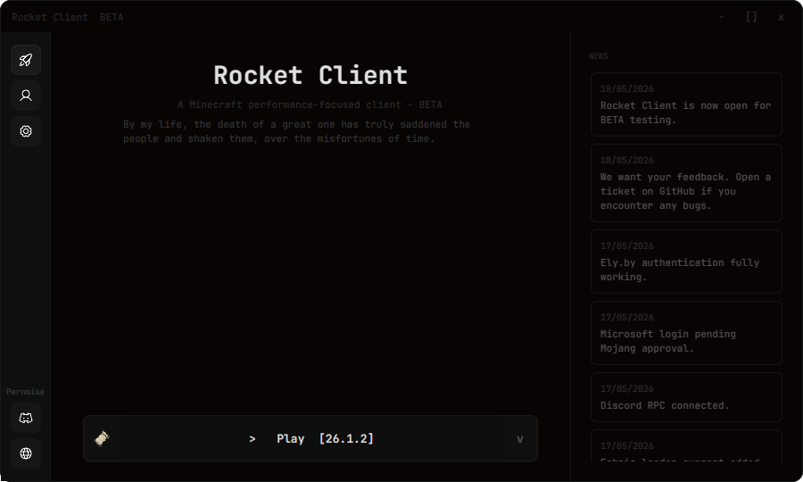
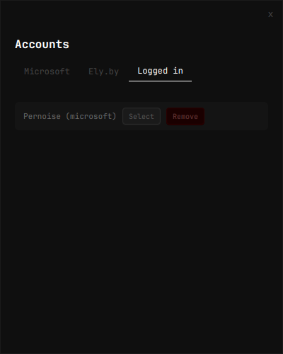
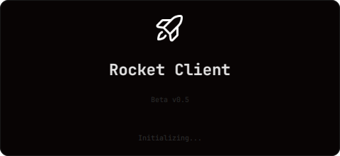

# Rocket Client

A modern, lightweight Minecraft launcher built with JavaFX.

Rocket Client is a modern Minecraft launcher focused on performance, simplicity, and a clean user experience.

---

## About

Rocket Client is an independently developed Minecraft launcher created by **Pernoise**.

Built entirely with **Java** and **JavaFX**, Rocket Client is designed to provide a clean, responsive, and lightweight experience without sacrificing modern functionality. The project supports Microsoft and Ely.by authentication, Discord Rich Presence, multiple Minecraft versions, and continues to evolve with new features and improvements.

Rocket Client is currently in **Beta** and is under active development.

---

# Gallery

## Launcher

---

## Account Manager

---

## Splash Screen

---

# Features

### Modern Interface

- Clean JavaFX user interface
- Minimalist dark theme
- Responsive layout
- Lightweight design

### Authentication

- Microsoft account authentication
- Ely.by account authentication
- Multiple saved accounts
- Local account management

### Launcher

- Minecraft version selection
- Built-in news panel
- Discord Rich Presence
- Cross-platform support
- Fast startup
- Performance-focused architecture

---

# Roadmap

## Completed

- [x] JavaFX launcher
- [x] Custom launcher interface
- [x] Splash screen
- [x] Microsoft authentication
- [x] Ely.by authentication
- [x] Multiple account management
- [x] Discord Rich Presence
- [x] News panel
- [x] Minecraft version selection

---

## In Development

- [x] Improved Microsoft authentication
- [x] Faster launcher startup
- [x] Automatic Java installation
- [ ] Improved download manager
- [ ] Better launcher settings
- [ ] Better error handling
- [x] Crash reporting
- [ ] General performance improvements

---

## Planned

- [ ] Automatic launcher updates
- [ ] Fabric installation
- [ ] Forge installation
- [ ] NeoForge installation
- [ ] Mod management
- [ ] Instance management
- [ ] Built-in log viewer
- [ ] Launcher themes
- [ ] Localization
- [ ] Additional quality-of-life improvements

---

# Repository Notice

Rocket Client's source code may be publicly accessible for transparency, verification, educational reference, or public inspection.

Public availability **does not** grant permission to:

- Compile the project
- Modify the source code
- Redistribute the project
- Fork the project for development
- Reuse code, assets, or resources
- Create derivative works
- Reupload any part of Rocket Client

Please refer to the **LICENSE** file for the complete terms and restrictions.

---

# Reporting Issues

If you encounter a bug or unexpected behavior, please open a ticket in the discord including:

- Rocket Client version
- Operating system
- Steps to reproduce
- Screenshots (if applicable)
- Crash logs (if available)

Feature suggestions are also welcome.

---

# Frequently Asked Questions

### Is Rocket Client open source?

No.

The repository may be publicly viewable for transparency, but the project is **not open source**. Please refer to the LICENSE file for the permissions and restrictions.

---

### Which operating systems are supported?

- Windows
- Linux

---

### Which account types are supported?

- Microsoft
- Ely.by

---

### Is Rocket Client finished?

No.

Rocket Client is currently in **Beta**, and new features, improvements, and fixes are actively being developed.

---

# License

Rocket Client is distributed under the **Rocket Client License**.

All rights are reserved.

Please read the `LICENSE` file before downloading, viewing, using, or interacting with any part of this project.

---

### Rocket Client

Developed by **Pernoise**

© 2026 Pernoise. All rights reserved.

If you enjoy Rocket Client, consider leaving the repository a ⭐.

Join the community:
https://discord.com/invite/urHfdFdsbh
